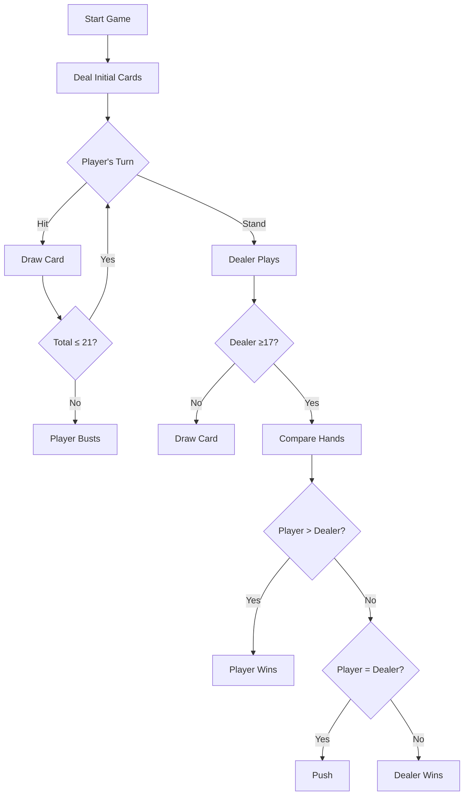

# 🃏 Blackjack Game Logic Documentation

## 🎯 Game Objective
The goal is to obtain a hand value closest to 21 without exceeding it ("busting"), beating the dealer (house). Players compete only against the dealer, not other players.

## 👥 Core Entities (Models)

### Player
- **Attributes**:
  - `playerId`: Unique identifier
  - `playerName`: Player display name
  - `localDataTime`: registration_date
  

### Dealer
- **Attributes**:
  - `dealerId`: Unique identifier

  
### Card
- **Attributes**:
  - `suit`: ♥ Hearts, ♦ Diamonds, ♣ Clubs, ♠ Spades
  - `rank`: A, 2-10, J, Q, K
  - `value`: Numeric value (dynamically calculated)

### GameLog
- **States**:
  - id: Unique identifier
  - playerName: player name
  - playerId: Unique identifier
  - List<Card> playerCards: Cards list player
  - List<Card> dealerCards: Cards list dealer
  - gameStatus: ENUM
  - betAmount: BigDecimal bet
  - lastMoveType: ENUM
  - totalAmount BigDecimal amount

## 👥 Domain (logic)

### Game
- **Attributes**:
  - List<Card> playerCards: Cards list player
  - List<Card> dealerCards: Cards list dealer

## 👥 DTO (data tranfer)

### GamePlayDto
- **Attributes**:
  - MoveType moveType: ENUM
  - BigDecimal amount: BigDecimal amount

### PlayerStatsDto
- **Attributes**:
  - playerId: Unique identifier
  - playerName: Player name
  - gamesPlayed: Games play
  - gamesWon: Games won
  - gamesLost: Games lost
  - gamesDrawn: Games draw
  - BigDecimal totalBet: BigDecimal bet
  - BigDecimal totalWon: Bigdecimal totalWon

## 🔄 Game Flow (API Endpoints)




## ⚠️ Special Cases

Natural Blackjack
Ace + any 10-value card (10, J, Q, K) in initial deal

Pays 3:2 (1.5x bet)

Push (Tie)
Player and dealer have equal non-bust totals

Player retains bet

Card Splitting
Not implemented in current version

💾 Data Persistence
MongoDB (Atlas)
Collection gameLogs:

```json
{
  "gameId": "UUID",
  "playerId": "123",
  "dealerHand": ["A♥", "K♠"],
  "playerHand": ["10♦", "6♣"],
  "betAmount": 50,
  "status": "PLAYER_WON",
  "timestamp": "2023-07-28T12:34:56Z"
}

```

MySQL (Railway)
Table players:

```sql
CREATE TABLE players (
  player_id VARCHAR(36) PRIMARY KEY,
  name VARCHAR(50) NOT NULL,
  localDataTime registration_date  
);
```

📈 Available Statistics
GET /statistics/{playerId}:

```json
{
  "playerId": "123",
  "winRate": 0.45,
  "gamesPlayed" 1,
  "gamesWon": 20,
  "gamesLost": 9,
  "gamesDrawn": 8,
  "totalBet": 250.00,
  "totalWon": 2345.00
}

```
🛠️ Future Enhancements

Implement card splitting

WIP......

Made with ❤️ by https://github.com/FlavioKde
---
